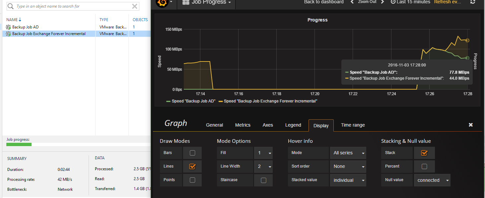

# JobToInflux

## Project Goals
Just a very simple solution that does not much, except query Veeam backup jobs every x time and put the status, transfer speed into an influxdb. This series can than later be used to plot graphs with graphana  

* Influxdb : https://www.influxdata.com/
* Grafana : http://grafana.org/

Sample dashboard:



This project does not use password protection for saving the data to influxdb. This is of course a security issue but it serves more as a starting point

## Compiling the source
When you open the solution, make sure to add the following references :

* add reference to System.Runtime.Serialization
* add reference to System.ServiceProcess
* add reference System.Configuration.Install
* also find nuget package InfluxDB.Collector (at the time in prerelease)
* also find nuget package System.Management.Automation (at the time in prerelease)

The part you want to look at to modify is WorkThread() in the InfluxCollectService.cs . Basically this is the code that does all the actual inputting. The Onstart() function is interesting as it does all the config handling and setting up the service.

The powershell code itself is configured as embededresource. This makes modifying the code itself easy without worrying about escaping quotes etc.

When you have a binary :
* Execute the binary with the keyword install (e.g. JobToInflux.exe install) on a Veeam B&R server (validate first in a test env). This should install the service (requires dotnet 4.x) and make a default config in %programdata%\\influxcollect\\config.json
* Modify the server ip (default 127.0.0.1)
* Start the service via services.msc
* Check the events logs and the influxdb to see if data is coming in

For influxdb, you can use "use veeam" to select the db and then "show measurements" to validate if data is flowing in

## Setting up InfluxDB and Grafana on Centos 7
This is extremely easy to do. Following code was executed on a base install so should work on almost every install

### install influxdata

[Official Install](https://docs.influxdata.com/influxdb/v1.0/introduction/installation/)

create repo
```
cat <<EOF | sudo tee /etc/yum.repos.d/influxdb.repo
[influxdb]
name = InfluxDB Repository - RHEL \$releasever
baseurl = https://repos.influxdata.com/rhel/\$releasever/\$basearch/stable
enabled = 1
gpgcheck = 1
gpgkey = https://repos.influxdata.com/influxdb.key
EOF
```

install
```
sudo yum install influxdb
sudo systemctl start influxdb
sudo systemctl enable influxdb
```

Default running on  http://localhost:8086

Make db
```
influx
create database veeam
show databases
```

### install grafana

[Official Install](http://docs.grafana.org/installation/rpm/)

create repo
```
cat <<EOF | sudo tee /etc/yum.repos.d/grafana.repo
[grafana]
name=grafana
baseurl=https://packagecloud.io/grafana/stable/el/6/\$basearch
repo_gpgcheck=1
enabled=1
gpgcheck=1
gpgkey=https://packagecloud.io/gpg.key https://grafanarel.s3.amazonaws.com/RPM-GPG-KEY-grafana
sslverify=1
sslcacert=/etc/pki/tls/certs/ca-bundle.crt
EOF
```

install
```
sudo yum install grafana
sudo systemctl start grafana-server
sudo systemctl enable grafana-server
```

* Env file is in */etc/sysconfig/grafana-server*
* Config file is in */etc/grafana/grafana.ini*
* Default website http://<host>:3000/ w login admin:admin

Login, go to top left icon, datasource. Add local InfluxDB
-> http://localhost:8086

Adding the InfluxDB should be quite straightforward


## Distributed under MIT license
Copyright (c) 2016 VeeamHub

Permission is hereby granted, free of charge, to any person obtaining a copy of this software and associated documentation files (the "Software"), to deal in the Software without restriction, including without limitation the rights to use, copy, modify, merge, publish, distribute, sublicense, and/or sell copies of the Software, and to permit persons to whom the Software is furnished to do so, subject to the following conditions:

The above copyright notice and this permission notice shall be included in all copies or substantial portions of the Software.

THE SOFTWARE IS PROVIDED "AS IS", WITHOUT WARRANTY OF ANY KIND, EXPRESS OR IMPLIED, INCLUDING BUT NOT LIMITED TO THE WARRANTIES OF MERCHANTABILITY, FITNESS FOR A PARTICULAR PURPOSE AND NONINFRINGEMENT. IN NO EVENT SHALL THE AUTHORS OR COPYRIGHT HOLDERS BE LIABLE FOR ANY CLAIM, DAMAGES OR OTHER LIABILITY, WHETHER IN AN ACTION OF CONTRACT, TORT OR OTHERWISE, ARISING FROM, OUT OF OR IN CONNECTION WITH THE SOFTWARE OR THE USE OR OTHER DEALINGS IN THE SOFTWARE.
